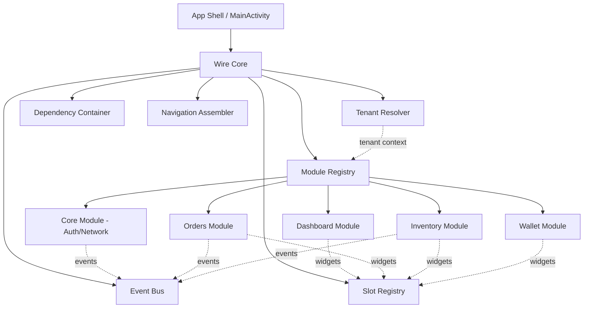
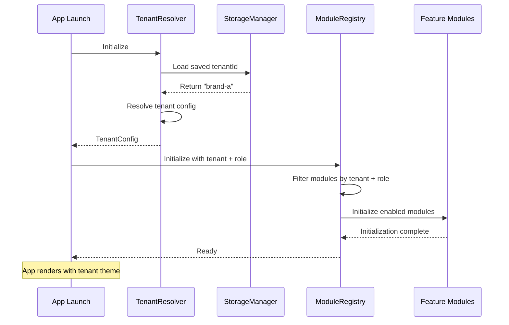

# System Design & Architecture

## Architecture Overview
**What is the high-level system structure?**



### Module Structure (Clean Architecture)
```
feature-module/
├── presentation/        # UI Layer
│   ├── screens/
│   ├── components/
│   └── viewmodels/
├── domain/             # Business Logic
│   ├── usecases/
│   ├── models/
│   └── repositories/   # Interfaces
├── data/               # Data Layer
│   ├── repositories/   # Implementations
│   ├── datasources/
│   └── api/
└── di/                 # Module DI
    └── ModuleProvider.kt
```

### Technology Stack
- **Language**: Kotlin
- **UI Framework**: Jetpack Compose
- **Dependency Injection**: Hilt
- **Navigation**: Compose Navigation + Custom Assembler
- **Async**: Coroutines + Flow
- **Build System**: Gradle (Kotlin DSL)
- **Module Discovery**: Runtime registration (no reflection)
- **Event Bus**: Custom Flow-based implementation

### Key Components

1. **App Shell** - Minimal MainActivity, bootstraps Wire Core
2. **Wire Core** - Orchestrates module lifecycle, communication, and tenant context
3. **Tenant Resolver** - Manages multi-tenant configuration and branding
4. **Module Registry** - Discovers and manages module instances with tenant/role filtering
5. **Module Contracts** - Shared interfaces for module communication
6. **Feature Modules** - Independent feature implementations (5 examples)
7. **Shared UI** - Common UI components and tenant-aware theme

## Data Models

### Core Entities

#### Module Metadata
```kotlin
data class ModuleMetadata(
    val id: String,              // "orders", "dashboard"
    val version: String,          // "1.0.0"
    val supportedRoles: List<Role>,
    val supportedTenants: List<String>? = null, // null = all tenants, else specific tenant IDs
    val tenantSpecific: Boolean = false,  // true if module behavior varies by tenant
    val dependencies: List<String>, // Other module IDs
    val enabled: Boolean = true
)

enum class Role {
    ADMIN,
    STAFF,
    CUSTOMER,
    GUEST
}
```

#### Route Definition
```kotlin
data class ModuleRoute(
    val path: String,             // "/orders"
    val destination: @Composable () -> Unit,
    val requiredRoles: List<Role> = emptyList(),
    val label: String? = null,
    val icon: ImageVector? = null
)
```

#### Widget/Slot Definition
```kotlin
data class UISlot(
    val slotId: String,           // "home_widgets"
    val moduleId: String,
    val priority: Int = 0,
    val content: @Composable () -> Unit,
    val requiredRoles: List<Role> = emptyList()
)
```

#### Event Definition
```kotlin
sealed class ModuleEvent {
    data class OrderCreated(val orderId: String) : ModuleEvent()
    data class UserAuthenticated(val userId: String, val role: Role) : ModuleEvent()
    data class FeatureFlagChanged(val key: String, val enabled: Boolean) : ModuleEvent()
    data class TenantSwitched(val oldTenantId: String, val newTenantId: String) : ModuleEvent()
    data class TenantConfigUpdated(val tenantId: String) : ModuleEvent()
}
```

#### Tenant Configuration
```kotlin
data class TenantConfig(
    val tenantId: String,              // "brand-a", "brand-b"
    val brandName: String,              // "Brand A", "Brand B"
    val theme: TenantTheme,            // Tenant-specific theming
    val enabledModules: Set<String>,   // Module IDs enabled for this tenant
    val enabledFeatures: Set<String>,  // Feature flags for this tenant
    val apiConfig: ApiConfig,          // Tenant-specific API configuration
    val logoRes: Int? = null,          // Tenant logo resource ID
    val locale: String = "en"          // Default locale for tenant
)

data class TenantTheme(
    val primaryColor: String,          // Hex color code
    val secondaryColor: String,
    val accentColor: String,
    val backgroundColor: String,
    val surfaceColor: String,
    val isDarkMode: Boolean = false
)

data class ApiConfig(
    val baseUrl: String,
    val apiKey: String? = null,
    val timeout: Long = 30000,
    val headers: Map<String, String> = emptyMap()
)
```

## API Design

### AppModule Interface
```kotlin
interface AppModule {
    val metadata: ModuleMetadata
    
    // Lifecycle
    fun initialize(context: ModuleContext)
    fun onDestroy()
    
    // DI Registration
    @get:InstallIn(SingletonComponent::class)
    val diModule: Any?
    
    // Navigation
    fun provideRoutes(): List<ModuleRoute>
    
    // Widget Slots
    fun provideWidgets(): List<UISlot>
    
    // Feature Flags
    fun requiredFlags(): List<String> = emptyList()
}
```

### ModuleContext
```kotlin
interface ModuleContext {
    val appContext: Context
    val eventBus: EventBus
    val navigator: AppNavigator
    val slotRegistry: SlotRegistry
    val tenantConfig: StateFlow<TenantConfig>  // Current tenant configuration
    val featureFlags: FeatureConfig
}
```

### Navigation Contract
```kotlin
interface AppNavigator {
    fun navigate(route: String, args: Bundle? = null)
    fun navigateBack()
    fun currentRoute(): StateFlow<String?>
}
```

### Event Bus Contract
```kotlin
interface EventBus {
    fun <T : ModuleEvent> publish(event: T)
    fun <T : ModuleEvent> subscribe(
        eventType: Class<T>,
        onEvent: (T) -> Unit
    ): Job
}

// Flow-based implementation
class FlowEventBus : EventBus {
    private val _events = MutableSharedFlow<ModuleEvent>()
    
    override fun <T : ModuleEvent> publish(event: T) {
        _events.tryEmit(event)
    }
    
    override fun <T : ModuleEvent> subscribe(
        eventType: Class<T>,
        onEvent: (T) -> Unit
    ): Job {
        return _events
            .filterIsInstance(eventType)
            .onEach(onEvent)
            .launchIn(CoroutineScope(Dispatchers.Main))
    }
}
```

### Slot Registry Contract
```kotlin
interface SlotRegistry {
    fun registerSlot(slot: UISlot)
    fun getSlotsForHost(slotId: String, userRole: Role): List<UISlot>
}
```

### Tenant Resolver Contract
```kotlin
interface TenantResolver {
    /**
     * Get current tenant configuration as a Flow
     */
    fun getCurrentTenant(): StateFlow<TenantConfig>
    
    /**
     * Switch to a different tenant (requires app restart or reconfiguration)
     */
    suspend fun switchTenant(tenantId: String): Result<Unit>
    
    /**
     * Get available tenants
     */
    fun getAvailableTenants(): List<TenantConfig>
    
    /**
     * Resolve tenant by ID
     */
    fun resolveTenantById(tenantId: String): TenantConfig?
    
    /**
     * Check if a module is enabled for current tenant
     */
    fun isModuleEnabledForTenant(moduleId: String): Boolean
}

// Implementation sketch
class TenantResolverImpl(
    private val storage: StorageManager,
    private val eventBus: EventBus
) : TenantResolver {
    
    private val _currentTenant = MutableStateFlow(getDefaultTenant())
    override fun getCurrentTenant(): StateFlow<TenantConfig> = _currentTenant.asStateFlow()
    
    override suspend fun switchTenant(tenantId: String): Result<Unit> {
        return try {
            val tenant = resolveTenantById(tenantId) 
                ?: return Result.failure(Exception("Tenant not found"))
            
            val oldTenant = _currentTenant.value
            _currentTenant.value = tenant
            
            // Persist tenant selection
            storage.saveTenantId(tenantId)
            
            // Notify modules
            eventBus.publish(ModuleEvent.TenantSwitched(oldTenant.tenantId, tenantId))
            
            Result.success(Unit)
        } catch (e: Exception) {
            Result.failure(e)
        }
    }
    
    // Additional implementation...
}
```

## Component Breakdown

### Core Module (`:core`)
**Responsibilities**:
- Networking layer (Retrofit setup)
- Authentication service
- Local storage (DataStore)
- Core domain models
- Base repository interfaces

**Exports**:
- `AuthService`
- `NetworkClient`
- `StorageManager`
- Core data models (User, Session)

### Wire Module (`:wire`)
**Responsibilities**:
- Module registry implementation
- Module lifecycle management
- Tenant resolver implementation
- Navigation assembler
- Event bus implementation
- Slot registry implementation
- Module context provider

**Exports**:
- `ModuleRegistry`
- `TenantResolver`
- `AppNavigator`
- `EventBus`
- `SlotRegistry`
- `ModuleContext`

### Contracts Module (`:contracts`)
**Responsibilities**:
- Module interfaces (`AppModule`)
- Navigation contracts
- Event definitions
- Widget/slot interfaces
- Shared DTOs

**No Implementation** - Pure interfaces and data classes

### Shared UI Module (`:shared-ui`)
**Responsibilities**:
- Design system components
- Theme definitions
- Common composables (Avatar, Card, Button)
- Layout helpers

**Exports**:
- Themed components
- Color/Typography system
- Reusable composables

### Feature Modules (`:feature-*`)

#### `:feature-core` (Always loaded)
- Authentication screens
- Splash/onboarding
- Settings

#### `:feature-dashboard` (Role: All)
- Home screen (widget host)
- Navigation drawer/bottom bar
- User profile summary

#### `:feature-orders` (Role: Admin, Staff)
- Orders list screen
- Order detail screen
- Order creation flow
- Contributes orders widget to dashboard

#### `:feature-inventory` (Role: Admin, Staff)
- Inventory/stock list screen
- Stock detail and tracking
- Low stock alerts
- Contributes inventory widget to dashboard

#### `:feature-wallet` (Role: All)
- Wallet balance display
- Transaction history
- Payment methods
- Contributes balance widget to dashboard

#### `:feature-profile` (Role: All - Optional 6th module)
- User profile screen
- Account settings
- Preferences management

## Design Decisions

### 1. Runtime Module Discovery (Not Annotation Processing)
**Decision**: Modules register themselves in Application.onCreate() by implementing a known interface.

**Rationale**:
- Simpler debugging
- No kapt/ksp dependency
- Clear execution flow
- Easier to understand for new developers

**Trade-off**: Need to manually add modules to registry list (acceptable for explicit control)

### 2. Hilt for DI (Not Koin)
**Decision**: Use Hilt as the DI framework.

**Rationale**:
- Compile-time safety
- Better multi-module support
- Google-recommended for Android
- Better integration with Jetpack

**Trade-off**: More boilerplate, steeper learning curve

### 3. Flow-based Event Bus (Not 3rd Party Library)
**Decision**: Build custom event bus using SharedFlow.

**Rationale**:
- Leverage Kotlin coroutines
- Type-safe events
- No external dependency
- Full control over implementation

**Trade-off**: Need to implement ourselves (but it's simple)

### 4. Compose Navigation with Custom Wrapper
**Decision**: Use Compose Navigation internally, wrap with custom Navigator interface.

**Rationale**:
- Leverage battle-tested library
- Abstract away implementation
- Modules depend on interface, not library
- Can swap implementation later if needed

### 5. All Modules in APK (No Dynamic Loading)
**Decision**: All modules bundled in APK, enabled/disabled via config.

**Rationale**:
- Simpler initial implementation
- Better performance (no network loading)
- Easier testing
- Can add dynamic loading later

**Trade-off**: Larger APK size (acceptable for enterprise apps)

### 6. Multi-Tenant via Runtime Configuration (Not Build Flavors)
**Decision**: Use runtime tenant resolution with configuration files, not Gradle build flavors.

**Rationale**:
- **Flexibility**: Can add new tenants without rebuilding app
- **Testing**: Easier to test multiple tenants in single build
- **Deployment**: Single APK can serve multiple tenants
- **Development**: 20 developers don't need multiple build variants
- **Tenant switching**: Allows runtime tenant switching if needed

**Trade-off**: Slightly more complex runtime logic, but worth it for flexibility

**Implementation Strategy**:
- Store tenant configs in assets/ or remote config
- TenantResolver loads appropriate config at startup
- Theme applied dynamically based on TenantConfig
- Module registry filters by tenant + role

**Alternative Considered**: Gradle build flavors per tenant
- **Rejected because**: Doesn't scale to many tenants, complicates builds, harder to test

### 7. Tenant Theme Switching via Compose MaterialTheme
**Decision**: Use Compose's MaterialTheme with dynamic color values from TenantConfig.

**Rationale**:
- **Native Compose support**: MaterialTheme designed for dynamic theming
- **No app restart needed**: Theme can update reactively
- **Type-safe**: Colors and styles defined in Compose
- **Performance**: No runtime overhead beyond normal Compose recomposition

**Implementation**:
```kotlin
@Composable
fun TenantAwareTheme(
    tenantTheme: TenantTheme,
    content: @Composable () -> Unit
) {
    val colorScheme = ColorScheme(
        primary = Color(android.graphics.Color.parseColor(tenantTheme.primaryColor)),
        secondary = Color(android.graphics.Color.parseColor(tenantTheme.secondaryColor)),
        // ... other colors
    )
    
    MaterialTheme(
        colorScheme = colorScheme,
        content = content
    )
}
```

**Trade-off**: Limited to color/typography changes; major UI restructuring would need more work

## Non-Functional Requirements

### Performance
- **Startup Time**: Module initialization <500ms for all modules
- **Navigation**: Screen transitions <100ms
- **Memory**: Each feature module <10MB overhead
- **Build Time**: Incremental builds <30s, clean build <5min

### Scalability
- Support 50+ feature modules without performance degradation
- Support 10+ tenants without performance impact
- Module registry lookup O(1) using HashMap
- Tenant resolution O(1) using HashMap
- Event bus supports 1000+ events/second
- Widget rendering: 10+ widgets on screen without jank
- Tenant switching: <1 second (theme reload + module re-init)

### Security
- Module isolation: modules cannot access each other's internals
- Role-based access enforced at module registry level
- Tenant isolation: modules filtered by tenant configuration
- Navigation security: unauthorized routes rejected
- Event security: events are type-safe, no reflection
- API keys per tenant: tenant-specific API configuration isolated
- Tenant data separation: each tenant's data logically separated

### Reliability
- Module failure doesn't crash entire app
- Try-catch around module initialization
- Fallback UI if module fails to load
- Logging for debugging module issues

### Maintainability
- Each module independently testable
- Clear separation of concerns (Clean Architecture)
- Comprehensive documentation
- Example modules as references
- Consistent code style via ktlint

## Module Dependency Rules

```
┌─────────────────────────────────────┐
│         App Shell (:app)            │
└──────────────┬──────────────────────┘
               │
       ┌───────┴────────┐
       ▼                ▼
┌──────────┐      ┌──────────────┐
│   Wire   │      │ Feature Mods │
│  (:wire) │      │ (:feature-*) │
└────┬─────┘      └──────┬───────┘
     │                   │
     │         ┌─────────┴─────────┐
     │         ▼                   ▼
     │    ┌─────────┐         ┌────────┐
     └───→│Contracts│         │Shared  │
          │(:contracts)       └────────┘
          └─────────┘          UI
               │
               ▼
          ┌─────────┐
          │  Core   │
          │ (:core) │
          └─────────┘
```

**Rules**:
1. Feature modules can depend on: contracts, shared-ui, core
2. Feature modules CANNOT depend on other feature modules
3. Wire depends on: contracts
4. Shared-ui depends on: contracts (for interfaces only)
5. Contracts and Core have no feature dependencies

## Project Structure
```
LargeScaleModule/
├── app/                           # App Shell
│   └── src/main/
│       ├── java/.../
│       │   ├── LargeScaleApp.kt  # Application class
│       │   └── MainActivity.kt    # Minimal activity
│       └── AndroidManifest.xml
│
├── contracts/                     # Pure interfaces
│   └── src/main/java/.../contracts/
│       ├── AppModule.kt
│       ├── ModuleContext.kt
│       ├── navigation/
│       ├── events/
│       └── slots/
│
├── wire/                          # Module orchestration
│   └── src/main/java/.../wire/
│       ├── ModuleRegistry.kt
│       ├── NavigationAssembler.kt
│       ├── FlowEventBus.kt
│       ├── SlotRegistryImpl.kt
│       └── ModuleContextImpl.kt
│
├── core/                          # Core services
│   └── src/main/java/.../core/
│       ├── auth/
│       ├── network/
│       └── storage/
│
├── shared-ui/                     # Design system
│   └── src/main/java/.../ui/
│       ├── components/
│       ├── theme/
│       └── layouts/
│
├── feature-core/                  # Essential features
│   └── src/main/java/.../feature/core/
│       ├── presentation/
│       ├── domain/
│       ├── data/
│       └── CoreFeatureModule.kt
│
├── feature-dashboard/
│   └── src/main/java/.../feature/dashboard/
│       └── DashboardFeatureModule.kt
│
├── feature-orders/
│   └── src/main/java/.../feature/orders/
│       └── OrdersFeatureModule.kt
│
├── feature-inventory/
│   └── src/main/java/.../feature/inventory/
│       └── InventoryFeatureModule.kt
│
└── feature-wallet/
    └── src/main/java/.../feature/wallet/
        └── WalletFeatureModule.kt
```

## Multi-Tenant Architecture Details

### Tenant Resolution Flow



### Tenant Configuration Storage

**Option 1: Assets JSON (Recommended for Phase 1)**
```
assets/
└── tenants/
    ├── tenants.json          # List of available tenants
    ├── brand-a.json          # Brand A configuration
    ├── brand-b.json          # Brand B configuration
    └── default.json          # Fallback configuration
```

Example `brand-a.json`:
```json
{
  "tenantId": "brand-a",
  "brandName": "Brand A",
  "theme": {
    "primaryColor": "#1976D2",
    "secondaryColor": "#42A5F5",
    "accentColor": "#FFB300",
    "backgroundColor": "#FFFFFF",
    "surfaceColor": "#F5F5F5",
    "isDarkMode": false
  },
  "enabledModules": ["dashboard", "orders", "inventory", "wallet", "profile"],
  "enabledFeatures": ["analytics", "push-notifications"],
  "apiConfig": {
    "baseUrl": "https://api.brand-a.com",
    "apiKey": "brand-a-key-here"
  },
  "locale": "en"
}
```

**Option 2: Remote Config (Future Phase)**
- Fetch tenant configurations from server
- Allows tenant updates without app update
- Requires connectivity on first launch

### Module Filtering by Tenant + Role

```kotlin
class ModuleRegistry(
    private val tenantResolver: TenantResolver
) {
    private val modules = mutableListOf<AppModule>()
    
    fun resolve(role: Role): List<AppModule> {
        val tenant = tenantResolver.getCurrentTenant().value
        
        return modules.filter { module ->
            // Check role
            val roleMatch = role in module.metadata.supportedRoles
            
            // Check tenant (null means all tenants)
            val tenantMatch = module.metadata.supportedTenants?.let { supportedTenants ->
                tenant.tenantId in supportedTenants
            } ?: true
            
            // Check if module enabled for tenant
            val enabledForTenant = module.metadata.id in tenant.enabledModules
            
            roleMatch && tenantMatch && enabledForTenant && module.metadata.enabled
        }
    }
}
```

### Tenant-Aware Theming

```kotlin
@Composable
fun LargeScaleModuleTheme(
    tenantConfig: TenantConfig,
    content: @Composable () -> Unit
) {
    val theme = tenantConfig.theme
    
    val colorScheme = if (theme.isDarkMode) {
        darkColorScheme(
            primary = parseColor(theme.primaryColor),
            secondary = parseColor(theme.secondaryColor),
            tertiary = parseColor(theme.accentColor)
        )
    } else {
        lightColorScheme(
            primary = parseColor(theme.primaryColor),
            secondary = parseColor(theme.secondaryColor),
            tertiary = parseColor(theme.accentColor),
            background = parseColor(theme.backgroundColor),
            surface = parseColor(theme.surfaceColor)
        )
    }
    
    MaterialTheme(
        colorScheme = colorScheme,
        typography = Typography,
        content = content
    )
}

@Composable
private fun parseColor(hexColor: String): Color {
    return Color(android.graphics.Color.parseColor(hexColor))
}
```

### Tenant Switching Process

**User Flow**:
1. User opens settings/tenant selector (debug menu or settings screen)
2. Selects different tenant from available list
3. App calls `tenantResolver.switchTenant(newTenantId)`
4. TenantResolver:
   - Saves new tenant ID to storage
   - Updates current tenant StateFlow
   - Publishes `TenantSwitched` event
5. Modules receive event and can react if needed
6. App shell observes tenant change and triggers recomposition
7. Theme updates automatically via Compose
8. Module registry re-resolves enabled modules
9. Navigation graph rebuilds with new modules

**Note**: For production, tenant switch may require app restart for clean state transition.

### Multi-Tenant Testing Strategy

**Unit Tests**:
```kotlin
@Test
fun `module registry filters by tenant correctly`() {
    val tenantA = TenantConfig(
        tenantId = "brand-a",
        enabledModules = setOf("orders", "dashboard")
    )
    
    val module = TestModule(
        id = "orders",
        supportedTenants = listOf("brand-a")
    )
    
    tenantResolver.setCurrentTenant(tenantA)
    val resolved = registry.resolve(Role.ADMIN)
    
    assertTrue(resolved.contains(module))
}
```

**Integration Tests**:
- Test app with different tenant configurations
- Verify theme changes correctly
- Verify correct modules load per tenant
- Test tenant switching flow

**UI Tests**:
- Screenshot tests for each tenant theme
- Verify branding elements (logo, colors) per tenant
- Test navigation across tenant-specific modules
```
