# System Design & Architecture

## Architecture Overview

The repository becomes a **platform-segregated monorepo**. All three platforms share the same conceptual architecture defined in `modular_mobile_architecture_principal_guide.md`, but implemented in idiomatic code for each.

```mermaid
graph TD
    Root[LargeScaleApp/]
    Root --> Android[android/]
    Root --> Flutter[flutter/]
    Root --> iOS[ios/]
    Root --> Docs[docs/]

    Android --> AApp[app/ - App Shell]
    Android --> AWire[wire/ - Wire Core]
    Android --> AContracts[contracts/ - Interfaces]
    Android --> ACore[core/ - Shared Services]
    Android --> ASharedUI[shared-ui/ - Design System]
    Android --> AFeatures[feature-*/]

    Flutter --> FApp[app/ - main.dart App Shell]
    Flutter --> FWire[wire/ - WireCore package]
    Flutter --> FContracts[contracts/ - Abstract Interfaces]
    Flutter --> FCore[core/ - Shared Services]
    Flutter --> FSharedUI[shared_ui/ - Widget Library]
    Flutter --> FFeatures[feature_*/]

    iOS --> IApp[App/ - AppDelegate + Shell]
    iOS --> IWire[WireCore/ - SPM package]
    iOS --> IContracts[Contracts/ - Protocols]
    iOS --> ICore[Core/ - Shared Services]
    iOS --> ISharedUI[SharedUI/ - SwiftUI Components]
    iOS --> IFeatures[Feature*/]
```



### Architectural Layer Consistency Across Platforms

| Concept | Android | Flutter | iOS |
|---------|---------|---------|-----|
| App Shell | `app/` Gradle module | `lib/main.dart` | `App/LargeScaleApp.swift` (@main SwiftUI App) |
| Wire Core | `:wire` Gradle module | `wire/` package | `WireCore` SPM package |
| Module Registry | `ModuleRegistry.kt` | `ModuleRegistry` (Dart) | `ModuleRegistry.swift` |
| Event Bus | `AppEventBus` (Flow) | `AppEventBus` (Stream) | `AppEventBus` (Combine) |
| Navigation | Jetpack Nav type-safe | `go_router` | NavigationStack / Router |
| DI Container | Hilt | get_it | Custom WireContainer (Swinject-compatible) |
| Widget Slots | `SlotRegistry.kt` | `SlotRegistry` (Dart) | `SlotRegistry.swift` |
| Role-Based Loading | `ModuleRegistry.resolve(role, tenantConfig)` | `ModuleRegistry.resolve(role, tenantConfig)` | `ModuleRegistry.resolve(role:tenant:)` |
| Shared UI | `:shared-ui` Compose | `shared_ui/` Flutter widgets | `SharedUI` SwiftUI package |
| Contracts | `:contracts` interfaces | `contracts/` abstract classes | `Contracts` protocols |

---

## Monorepo Directory Structure

```
LargeScaleApp/
├── android/                         # All existing Android source (moved here)
│   ├── app/
│   ├── core/
│   ├── contracts/
│   ├── wire/
│   ├── feature-core/
│   ├── feature-dashboard/
│   ├── feature-inventory/
│   ├── feature-orders/
│   ├── feature-wallet/
│   ├── shared-ui/
│   ├── build.gradle.kts
│   ├── settings.gradle.kts
│   ├── gradle.properties
│   ├── gradlew
│   ├── gradlew.bat
│   ├── local.properties
│   └── gradle/
│       └── libs.versions.toml
│
├── flutter/                         # Flutter project
│   ├── app/                         # App shell (main.dart lives here)
│   │   └── lib/
│   │       └── main.dart
│   ├── wire/                        # Wire Core package
│   │   ├── lib/
│   │   │   ├── src/
│   │   │   │   ├── module_registry.dart
│   │   │   │   ├── event_bus.dart
│   │   │   │   ├── slot_registry.dart
│   │   │   │   └── wire_container.dart
│   │   │   └── wire.dart
│   │   └── pubspec.yaml
│   ├── contracts/                   # Shared interfaces/abstract classes
│   │   ├── lib/
│   │   │   ├── src/
│   │   │   │   ├── app_module.dart
│   │   │   │   ├── app_navigator.dart
│   │   │   │   ├── app_widget.dart
│   │   │   │   └── app_route.dart
│   │   │   └── contracts.dart
│   │   └── pubspec.yaml
│   ├── core/                        # Always-loaded shared services
│   │   ├── lib/
│   │   │   ├── src/
│   │   │   │   ├── auth/
│   │   │   │   ├── network/
│   │   │   │   └── storage/
│   │   │   └── core.dart
│   │   └── pubspec.yaml
│   ├── shared_ui/                   # Reusable widgets + theme
│   │   ├── lib/
│   │   │   ├── src/
│   │   │   │   ├── components/
│   │   │   │   └── theme/
│   │   │   └── shared_ui.dart
│   │   └── pubspec.yaml
│   ├── feature_dashboard/
│   │   ├── lib/
│   │   │   ├── src/
│   │   │   │   ├── presentation/
│   │   │   │   ├── domain/
│   │   │   │   └── data/
│   │   │   └── feature_dashboard.dart
│   │   └── pubspec.yaml
│   ├── feature_orders/
│   ├── feature_inventory/
│   ├── feature_wallet/
│   └── pubspec.yaml                 # Root workspace pubspec (Flutter workspaces)
│
├── ios/                             # iOS Swift project
│   ├── App/                         # App shell (Xcode project)
│   │   ├── AppDelegate.swift
│   │   ├── SceneDelegate.swift
│   │   ├── ContentView.swift
│   │   ├── App.xcodeproj/
│   │   └── App.xcworkspace/
│   ├── Packages/                    # Swift Package Manager local packages
│   │   ├── WireCore/
│   │   │   ├── Sources/WireCore/
│   │   │   │   ├── ModuleRegistry.swift
│   │   │   │   ├── AppEventBus.swift
│   │   │   │   ├── SlotRegistry.swift
│   │   │   │   └── WireContainer.swift
│   │   │   └── Package.swift
│   │   ├── Contracts/
│   │   │   ├── Sources/Contracts/
│   │   │   │   ├── AppModule.swift
│   │   │   │   ├── AppNavigator.swift
│   │   │   │   ├── AppWidget.swift
│   │   │   │   └── AppRoute.swift
│   │   │   └── Package.swift
│   │   ├── Core/
│   │   │   ├── Sources/Core/
│   │   │   │   ├── Auth/
│   │   │   │   ├── Network/
│   │   │   │   └── Storage/
│   │   │   └── Package.swift
│   │   ├── SharedUI/
│   │   │   ├── Sources/SharedUI/
│   │   │   │   ├── Components/
│   │   │   │   └── Theme/
│   │   │   └── Package.swift
│   │   ├── FeatureDashboard/
│   │   ├── FeatureOrders/
│   │   ├── FeatureInventory/
│   │   └── FeatureWallet/
│   └── README.md
│
├── docs/                            # Shared architecture docs (unchanged)
│   ├── ai/
│   ├── adr/
│   └── guides/
├── modular_mobile_architecture_principal_guide.md
└── README.md
```

---

## Data Models

### ModuleMetadata

Carries module identity, access control, and multi-tenant eligibility. Used by `ModuleRegistry` to filter modules.

**Android (Kotlin)**:
```kotlin
data class ModuleMetadata(
    val id: String,
    val name: String,
    val version: String = "1.0.0",
    val requiredRoles: Set<Role> = setOf(Role.ADMIN, Role.STAFF, Role.CUSTOMER),
    val supportedTenants: List<String> = emptyList(), // empty = all tenants
    val priority: Int = 100
)
```

Platform equivalents (Dart / Swift) mirror the same fields.

### AppModule Contract (all platforms)

The **real** contract — modules expose metadata, receive a `ModuleContext` for initialization, and provide routes + widgets declaratively.

**Android (Kotlin)**:
```kotlin
interface AppModule {
    val metadata: ModuleMetadata
    fun initialize(context: ModuleContext)
    fun onDestroy() {}
    fun provideRoutes(): List<ModuleRoute> = emptyList()
    fun provideWidgets(): List<UISlot> = emptyList()
}
```

**Flutter (Dart)**:
```dart
abstract class AppModule {
  ModuleMetadata get metadata;
  void initialize(ModuleContext context);
  void onDestroy() {}
  List<ModuleRoute> provideRoutes() => [];
  List<UISlot> provideWidgets() => [];
}
```

**iOS (Swift)**:
```swift
public protocol AppModule: AnyObject {
    var metadata: ModuleMetadata { get }
    func initialize(context: ModuleContext)
    func onDestroy()
    func provideRoutes() -> [ModuleRoute]
    func provideWidgets() -> [UISlot]
}
```

### ModuleContext

The gateway provided to each module during `initialize()`. Gives access to all Wire Core services without exposing a raw DI container.

```kotlin
interface ModuleContext {
    val tenantConfig: StateFlow<TenantConfig?>    // reactive tenant config
    val currentRole: StateFlow<Role>             // reactive current role
    val eventBus: EventBus                        // pub/sub
    val slotRegistry: SlotRegistry               // UI slot injection
    fun navigate(route: String)
    fun getApplicationContext(): Any
}
```

### TenantConfig

Enables white-label / multi-tenant configuration per module.

```kotlin
data class TenantConfig(
    val tenantId: String,
    val displayName: String,
    val enabledModules: List<String> = emptyList(),
    val theme: TenantTheme = TenantTheme(),
    val apiConfig: ApiConfig = ApiConfig()
)
```

### ModuleEvent (sealed base — Android), abstract base (Dart/Swift)

All cross-module events extend `ModuleEvent`. This enforces type safety and prevents untyped `Any` events.

**Predefined events**: `UserAuthenticatedEvent`, `UserLoggedOutEvent`, `ModuleInitializedEvent`, `OrderCreatedEvent`, `TenantSwitchedEvent`, `TenantConfigUpdatedEvent`, `FeatureFlagChangedEvent`, `NavigationRequestedEvent`

### ModuleRoute & UISlot

```kotlin
data class ModuleRoute(val route: String, val requiredRole: Role = Role.GUEST)

data class UISlot(
    val slotId: String,         // e.g., SlotIds.HOME_WIDGETS
    val widgetId: String,
    val moduleId: String,
    val priority: Int = 100,
    val requiredRole: Role = Role.GUEST,
    val content: @Composable () -> Unit
)
```

### SlotIds Constants (known slot host IDs)
```kotlin
object SlotIds {
    const val HOME_WIDGETS = "home_widgets"
    const val DASHBOARD_HEADER = "dashboard_header"
    const val PROFILE_ACTIONS = "profile_actions"
    const val BOTTOM_BAR_ACTIONS = "bottom_bar_actions"
    const val HOME_QUICK_ACTIONS = "home_quick_actions"
}
```

### ModuleRegistry.resolve() signature (all platforms)
```kotlin
fun resolve(role: Role, tenantConfig: TenantConfig?): List<AppModule>
```
A module is active when: (1) `role ∈ metadata.requiredRoles` AND (2) `supportedTenants` is empty OR tenant is listed AND (3) module ID is in `tenantConfig.enabledModules`.

### EventBus Contract

**Android**: `EventBus` interface, backed by `SharedFlow<ModuleEvent>`, typed via `subscribe(KClass, handler)`  
**Flutter**: `AppEventBus` backed by `StreamController<ModuleEvent>.broadcast()`, typed via `on<T>()`  
**iOS**: `AppEventBus` backed by `PassthroughSubject<Any, Never>` (Combine), typed via `on(_:)` returning `AnyPublisher<T, Never>`

### Role Enum (all platforms)
```
ADMIN | STAFF | CUSTOMER | GUEST
```

---

## Component Breakdown

### Wire Core (per platform)

| Component | Responsibility |
|-----------|---------------|
| `ModuleRegistry` | Stores all modules, resolves by role |
| `WireContainer` | DI container abstraction (wraps Hilt/get_it/Swinject) |
| `AppEventBus` | Type-safe pub/sub event system |
| `SlotRegistry` | Registers and resolves UI widgets by slot ID |
| `NavigationAssembler` | Builds the app's navigation graph from module routes |

### Feature Module (per platform, same structure)

```
feature_<name>/
├── presentation/     # Screens, ViewModels / Cubits / ViewModels
├── domain/           # UseCases, Repository interfaces, Domain models
├── data/             # Repository implementations, remote/local sources
└── module/           # AppModule implementation (register + routes)
```

### Shared UI (per platform)

| Component | Android | Flutter | iOS |
|-----------|---------|---------|-----|
| Design Tokens | `Theme.kt` | `app_theme.dart` | `AppTheme.swift` |
| Card Component | `ProductCard` (Compose) | `ProductCard` (Widget) | `ProductCard` (SwiftUI View) |
| Avatar | `AvatarComponent` | `AvatarWidget` | `AvatarView` |
| Rating | `RatingBar` | `RatingWidget` | `RatingView` |

---

## Design Decisions

### Decision 1: Monorepo with Platform Subdirectories
**Chosen**: `android/`, `flutter/`, `ios/` at root  
**Rationale**: Clean separation while sharing docs and architecture guide. Each platform is independently buildable. No build tool coupling.  
**Alternative considered**: Separate repos per platform — rejected because it fragments architecture decisions and makes cross-platform consistency harder.

### Decision 2: No Shared Business Logic (no KMP)
**Chosen**: Each platform re-implements domain/data layers in native language  
**Rationale**: Keeps each platform idiomatic, reduces build complexity, avoids KMP learning curve for Flutter devs  
**Alternative considered**: Kotlin Multiplatform for shared domain — deferred to future phase

### Decision 3: Flutter Workspaces (multi-package)
**Chosen**: Each Flutter module is a separate Dart package under `flutter/`  
**Rationale**: Mirrors the Android Gradle multi-module structure; enforces module boundaries  
**Alternative considered**: Single flat Flutter app with folders — rejected because it doesn't enforce module isolation

### Decision 4: iOS Swift Package Manager for Module Isolation
**Chosen**: Local SPM packages under `ios/Packages/`  
**Rationale**: SPM is the modern standard for iOS modularization; allows same `import WireCore` isolation as Gradle modules  
**Alternative considered**: CocoaPods or Tuist — SPM is zero-config and Xcode-native

### Decision 5: Shared `docs/` at Repo Root
**Chosen**: `docs/` stays at monorepo root (not duplicated per platform)  
**Rationale**: Architecture guide, ADRs, and AI docs apply to all platforms

---

## Non-Functional Requirements

- **Buildability**: Each platform folder must build independently with standard tooling (Gradle, Flutter CLI, Xcode)
- **Discoverability**: Developer can understand the module structure within 5 minutes of opening any platform folder
- **Isolation**: Feature modules must not reference each other directly — only via `contracts/` + event bus
- **Consistency**: The same 4 feature modules (dashboard, orders, inventory, wallet) exist in all three platforms as skeletons
- **Scalability**: Architecture supports adding new feature modules without touching app shell or wire core
