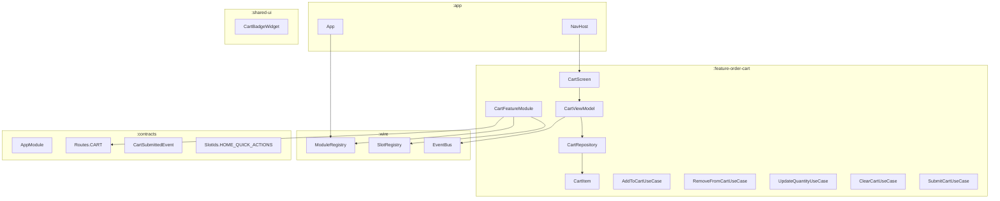

# System Design & Architecture — Order Cart

## Architecture Overview

The `order-cart` feature follows the same **Wire Core / plug-and-play** pattern as all other feature modules.



### Layer structure inside `:feature-order-cart`

```
feature-order-cart/
└── src/main/java/com/densitech/largescale/feature/cart/
    ├── CartFeatureModule.kt          # AppModule entry point
    ├── data/
    │   ├── CartRepository.kt         # Interface
    │   ├── CartRepositoryImpl.kt     # DataStore-backed implementation
    │   └── CartDataStore.kt          # Proto/Preferences DataStore helper
    ├── domain/
    │   ├── CartItem.kt               # Domain model
    │   ├── Cart.kt                   # Domain model (list of CartItems + total)
    │   ├── AddToCartUseCase.kt
    │   ├── RemoveFromCartUseCase.kt
    │   ├── UpdateQuantityUseCase.kt
    │   ├── ClearCartUseCase.kt
    │   └── SubmitCartUseCase.kt
    ├── ui/
    │   ├── cart/
    │   │   ├── CartScreen.kt         # Full cart screen
    │   │   └── CartViewModel.kt
    │   └── widget/
    │       └── CartBadgeWidget.kt    # Dashboard HOME_QUICK_ACTIONS slot
    ├── nav/
    │   └── CartNavGraph.kt
    └── di/
        └── CartModule.kt             # Hilt module
```

## Data Models

### Domain models (pure Kotlin, no framework annotations)

```kotlin
data class CartItem(
    val itemId: String,
    val name: String,
    val imageUrl: String?,
    val unitPrice: Double,
    val quantity: Int
) {
    val subtotal: Double get() = unitPrice * quantity
}

data class Cart(
    val items: List<CartItem> = emptyList()
) {
    val totalPrice: Double get() = items.sumOf { it.subtotal }
    val totalCount: Int    get() = items.sumOf { it.quantity }
    val isEmpty: Boolean   get() = items.isEmpty()
}
```

### UI state

```kotlin
sealed interface CartUiState {
    object Loading : CartUiState
    data class Success(val cart: Cart) : CartUiState
    data class Error(val message: String) : CartUiState
}
```

## API / Interfaces

### CartRepository interface (in `:feature-order-cart`)

```kotlin
interface CartRepository {
    fun observeCart(): Flow<Cart>
    suspend fun addItem(item: CartItem)
    suspend fun removeItem(itemId: String)
    suspend fun updateQuantity(itemId: String, quantity: Int)
    suspend fun clearCart()
    suspend fun submitCart(): Result<String>   // returns orderId on success
}
```

### New contract additions (`:contracts`)

**Routes.kt** — add:
```kotlin
const val CART = "/cart"
```

**ModuleEvent.kt** — add:
```kotlin
data class CartSubmittedEvent(
    val cartItems: List<String>,   // itemIds
    val totalAmount: Double,
    val customerId: String
) : ModuleEvent
```

## Component Breakdown

| Component | Responsibility |
|-----------|----------------|
| `CartFeatureModule` | Registers routes, registers `CartBadgeWidget` in `HOME_QUICK_ACTIONS` slot |
| `CartScreen` | Full-page cart UI: item list, quantity controls, total, submit button |
| `CartViewModel` | Collects `CartUiState` from use cases, handles user actions |
| `CartBadgeWidget` | Compact slot widget showing item count; tapping navigates to `/cart` |
| `AddToCartUseCase` | Merges item into cart (increment quantity if exists) |
| `RemoveFromCartUseCase` | Removes a single item by `itemId` |
| `UpdateQuantityUseCase` | Sets quantity ≥ 1; removes item if quantity reaches 0 |
| `ClearCartUseCase` | Empties entire cart |
| `SubmitCartUseCase` | Calls repository, publishes `CartSubmittedEvent`, clears cart |
| `CartRepositoryImpl` | Persists cart to `DataStore<Preferences>` |

## Design Decisions

| Decision | Choice | Rationale |
|----------|--------|-----------|
| Persistence | `DataStore<Preferences>` (JSON-serialized) | Lightweight; no schema migration for v1 |
| Cross-module communication | `CartSubmittedEvent` via `EventBus` | Keeps `:feature-order-cart` decoupled from `:feature-orders` |
| Navigation into cart | Via `Routes.CART` constant in `:contracts` | Any module can deeplink; no direct import needed |
| Widget registration | `initialize(context)` pattern (same as `feature-orders`) | Widget captures `context.navigate` lambda |
| Role gate | `Role.CUSTOMER` only | Matches business requirement; staff/admin do not shop |

## Non-Functional Requirements

- **Performance**: Cart list must render < 16 ms per frame; use `LazyColumn` + stable keys.
- **Persistence**: Cart survives process death (DataStore) and app restarts.
- **Security**: No sensitive payment data stored in cart; `unitPrice` treated as display-only until order confirmation.
- **Reliability**: Failed submit (network error) should NOT clear the cart; show an error snackbar instead.
