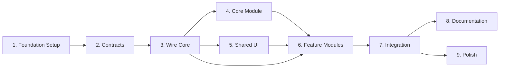

# Project Planning & Task Breakdown

## Milestones

- [ ] **Milestone 1: Foundation Setup** (Week 1) - Core infrastructure and module structure
- [ ] **Milestone 2: Wire Core Implementation** (Week 1-2) - Registry, navigation, events
- [ ] **Milestone 3: Example Modules** (Week 2) - Working feature modules with integration
- [ ] **Milestone 4: Documentation & Polish** (Week 2) - Team guidelines and cleanup

## Task Breakdown

### Phase 1: Foundation & Project Structure (Days 1-2)

#### 1.1 Project Configuration
- [x] Update `settings.gradle.kts` to include new modules
- [x] Create Gradle version catalog entries for dependencies
- [x] Configure Hilt in root `build.gradle.kts`
- [ ] Set up ktlint/detekt for code quality
- [ ] Create `buildSrc` for shared build logic (optional)

**Estimated Effort**: 4 hours  
**Dependencies**: None  
**Owner**: Tech Lead

#### 1.2 Create Module Structure
- [x] Create `:contracts` module with basic interfaces
- [x] Create `:wire` module structure
- [x] Create `:core` module structure
- [x] Create `:shared-ui` module structure
- [x] Create `:feature-core` module structure
- [x] Create `:feature-dashboard` module structure
- [x] Create `:feature-orders` module structure

**Estimated Effort**: 3 hours  
**Dependencies**: 1.1 Project Configuration  
**Owner**: Tech Lead

#### 1.3 Configure Module Dependencies
- [x] Set up dependency graph in each `build.gradle.kts`
- [x] Add Hilt dependencies to each module
- [x] Add Compose dependencies to UI modules
- [x] Configure proper module visibility/exporting
- [x] Verify build succeeds for all modules

**Estimated Effort**: 2 hours  
**Dependencies**: 1.2 Module Structure  
**Owner**: Tech Lead

---

### Phase 2: Contracts & Interfaces (Day 2)

#### 2.1 Core Contracts
- [x] Define `AppModule` interface
- [x] Define `ModuleMetadata` data class
- [x] Define `Role` enum
- [x] Define `ModuleContext` interface
- [x] Create base `ModuleEvent` sealed class

**Estimated Effort**: 2 hours  
**Dependencies**: 1.2 Module Structure  
**Owner**: Senior Developer

#### 2.2 Navigation Contracts
- [x] Define `AppNavigator` interface
- [x] Define `ModuleRoute` data class
- [x] Create route constants/sealed class structure
- [x] Define navigation arguments pattern

**Estimated Effort**: 2 hours  
**Dependencies**: 2.1 Core Contracts  
**Owner**: Senior Developer

#### 2.3 Widget/Slot Contracts
- [ ] Define `UISlot` interface
- [ ] Define `SlotRegistry` interface
- [ ] Create slot ID constants
- [ ] Define widget composition patterns

**Estimated Effort**: 1.5 hours  
**Dependencies**: 2.1 Core Contracts  
**Owner**: Senior Developer

#### 2.4 Event Bus Contracts
- [ ] Define `EventBus` interface
- [ ] Create common event types (OrderCreated, UserAuthenticated, etc.)
- [ ] Define event subscription patterns
- [ ] Document event naming conventions

**Estimated Effort**: 1.5 hours  
**Dependencies**: 2.1 Core Contracts  
**Owner**: Senior Developer

---

### Phase 3: Wire Core Implementation (Days 3-5)

#### 3.1 Module Registry
- [ ] Implement `ModuleRegistry` class
- [ ] Add module storage (mutableListOf or HashMap)
- [ ] Implement `registerModule()` method
- [ ] Implement `resolve(role: Role)` filtering method
- [ ] Implement `getModuleById()` lookup
- [ ] Add module lifecycle tracking
- [ ] Add unit tests for registry logic

**Estimated Effort**: 4 hours  
**Dependencies**: 2.1 Core Contracts  
**Owner**: Senior Developer

#### 3.2 Event Bus Implementation
- [ ] Implement `FlowEventBus` using SharedFlow
- [ ] Implement `publish()` method
- [ ] Implement `subscribe()` method with type filtering
- [ ] Add coroutine scope management
- [ ] Add thread safety (Dispatchers.Main)
- [ ] Implement unsubscribe/cleanup
- [ ] Add unit tests for event publishing/subscription

**Estimated Effort**: 3 hours  
**Dependencies**: 2.4 Event Bus Contracts  
**Owner**: Developer

#### 3.3 Navigation Assembler
- [ ] Create `AppNavigatorImpl` using Compose Navigation
- [ ] Implement `NavHostController` wrapper
- [ ] Implement route registration from modules
- [ ] Implement `navigate()` with argument support
- [ ] Implement `navigateBack()`
- [ ] Add deep linking support
- [ ] Add navigation state management
- [ ] Add unit tests for navigation logic

**Estimated Effort**: 5 hours  
**Dependencies**: 2.2 Navigation Contracts  
**Owner**: Senior Developer

#### 3.4 Slot Registry Implementation
- [ ] Implement `SlotRegistryImpl`
- [ ] Add slot storage by slotId
- [ ] Implement `registerSlot()` method
- [ ] Implement `getSlotsForHost()` with role filtering
- [ ] Add priority sorting
- [ ] Implement slot composition helper
- [ ] Add unit tests for slot registration/retrieval

**Estimated Effort**: 3 hours  
**Dependencies**: 2.3 Widget/Slot Contracts  
**Owner**: Developer

#### 3.5 Module Context
- [ ] Implement `ModuleContextImpl`
- [ ] Inject EventBus, Navigator, SlotRegistry
- [ ] Add feature flag provider
- [ ] Add application Context
- [ ] Create factory method for context creation

**Estimated Effort**: 2 hours  
**Dependencies**: 3.1, 3.2, 3.3, 3.4  
**Owner**: Developer

#### 3.6 App Initialization Flow
- [ ] Create `LargeScaleApp` Application class
- [ ] Set up Hilt application component
- [ ] Initialize Wire Core in onCreate()
- [ ] Implement module discovery/registration flow
- [ ] Add authentication check
- [ ] Implement role resolution
- [ ] Call module initialization
- [ ] Build navigation graph
- [ ] Add error handling and logging

**Estimated Effort**: 4 hours  
**Dependencies**: 3.1-3.5  
**Owner**: Tech Lead

---

### Phase 4: Core Module (Days 4-5)

#### 4.1 Authentication Service
- [ ] Create `AuthService` interface in contracts
- [ ] Implement mock `AuthServiceImpl`
- [ ] Add login/logout methods
- [ ] Add `getCurrentUser()` returning Flow<User?>
- [ ] Add `getCurrentRole()` method
- [ ] Store session in DataStore
- [ ] Add Hilt module for DI
- [ ] Add unit tests

**Estimated Effort**: 4 hours  
**Dependencies**: 2.1 Core Contracts  
**Owner**: Developer

#### 4.2 Network Layer
- [ ] Set up Retrofit builder
- [ ] Create base API client
- [ ] Add interceptors (auth, logging)
- [ ] Add error handling wrapper
- [ ] Add Hilt module for DI
- [ ] Add integration tests

**Estimated Effort**: 3 hours  
**Dependencies**: None  
**Owner**: Developer

#### 4.3 Storage Layer
- [ ] Set up DataStore Preferences
- [ ] Create `StorageManager` wrapper
- [ ] Add key-value storage methods
- [ ] Add Hilt module for DI
- [ ] Add unit tests

**Estimated Effort**: 2 hours  
**Dependencies**: None  
**Owner**: Developer

---

### Phase 5: Shared UI Module (Day 5)

#### 5.1 Design System
- [ ] Create `AppTheme` composable
- [ ] Define color palette (Material 3)
- [ ] Define typography scale
- [ ] Define spacing constants
- [ ] Define shape definitions
- [ ] Create theme preview screens

**Estimated Effort**: 3 hours  
**Dependencies**: None  
**Owner**: UI Developer

#### 5.2 Common Components
- [ ] Create `AppButton` component
- [ ] Create `AppCard` component
- [ ] Create `AppAvatar` component
- [ ] Create `AppTextField` component
- [ ] Create `LoadingIndicator` component
- [ ] Create `ErrorView` component
- [ ] Add previews for all components

**Estimated Effort**: 4 hours  
**Dependencies**: 5.1 Design System  
**Owner**: UI Developer

---

### Phase 6: Feature Modules (Days 6-8)

#### 6.1 Feature-Core Module (Authentication)
- [ ] Create `CoreFeatureModule` implementing AppModule
- [ ] Create login screen (Compose)
- [ ] Create splash screen
- [ ] Create settings screen
- [ ] Create ViewModels with Hilt
- [ ] Implement `provideRoutes()`
- [ ] Add navigation to routes
- [ ] Add unit tests for ViewModels
- [ ] Add UI tests for screens

**Estimated Effort**: 8 hours  
**Dependencies**: 3.6, 4.1, 5.2  
**Owner**: Feature Team A

#### 6.2 Feature-Dashboard Module
- [ ] Create `DashboardFeatureModule` implementing AppModule
- [ ] Create home screen with slot hosts
- [ ] Create navigation drawer/bottom bar
- [ ] Create profile summary widget
- [ ] Create ViewModel
- [ ] Implement `provideRoutes()`
- [ ] Implement `provideWidgets()` for home widgets
- [ ] Connect to SlotRegistry
- [ ] Add unit tests
- [ ] Add UI tests

**Estimated Effort**: 6 hours  
**Dependencies**: 3.6, 5.2  
**Owner**: Feature Team B

#### 6.3 Feature-Orders Module
- [ ] Create `OrdersFeatureModule` implementing AppModule
- [ ] Create orders list screen
- [ ] Create order detail screen
- [ ] Create order summary widget (for dashboard)
- [ ] Create ViewModels
- [ ] Create mock repository
- [ ] Implement `provideRoutes()`
- [ ] Implement `provideWidgets()` for dashboard
- [ ] Add role-based access (ADMIN, STAFF only)
- [ ] Publish `OrderCreated` event example
- [ ] Subscribe to events example
- [ ] Add unit tests
- [ ] Add UI tests

**Estimated Effort**: 8 hours  
**Dependencies**: 3.6, 5.2  
**Owner**: Feature Team C

---

### Phase 7: Integration & Testing (Days 8-9)

#### 7.1 Module Registration
- [ ] Register all modules in `LargeScaleApp`
- [ ] Verify module discovery works
- [ ] Test role-based filtering
- [ ] Test module initialization order
- [ ] Add integration test for full flow

**Estimated Effort**: 2 hours  
**Dependencies**: 6.1, 6.2, 6.3  
**Owner**: Tech Lead

#### 7.2 Navigation Integration
- [ ] Test navigation across modules
- [ ] Test deep linking
- [ ] Test back navigation
- [ ] Test argument passing
- [ ] Add navigation integration tests

**Estimated Effort**: 3 hours  
**Dependencies**: 7.1  
**Owner**: Senior Developer

#### 7.3 Widget/Slot Integration
- [ ] Verify widgets appear on dashboard
- [ ] Test widget priority ordering
- [ ] Test role-based widget visibility
- [ ] Test widget interactivity
- [ ] Add screenshot tests for widget layouts

**Estimated Effort**: 2 hours  
**Dependencies**: 7.1  
**Owner**: UI Developer

#### 7.4 Event Bus Integration
- [ ] Test cross-module event communication
- [ ] Verify event subscription lifecycle
- [ ] Test event filtering by type
- [ ] Add integration tests for events

**Estimated Effort**: 2 hours  
**Dependencies**: 7.1  
**Owner**: Developer

#### 7.5 Role-Based Access Testing
- [ ] Test ADMIN role sees all modules
- [ ] Test CUSTOMER role sees limited modules
- [ ] Test GUEST role sees public modules only
- [ ] Test unauthorized navigation blocked
- [ ] Add integration tests for access control

**Estimated Effort**: 3 hours  
**Dependencies**: 7.1  
**Owner**: Senior Developer

---

### Phase 8: Documentation & Developer Experience (Days 9-10)

#### 8.1 Architecture Documentation
- [ ] Write architecture overview (README.md in root)
- [ ] Document module structure conventions
- [ ] Create architecture diagrams
- [ ] Document dependency rules
- [ ] Add ADRs (Architecture Decision Records)

**Estimated Effort**: 4 hours  
**Dependencies**: All implementation complete  
**Owner**: Tech Lead

#### 8.2 Developer Guides
- [ ] Write "Creating a New Module" guide
- [ ] Write "Adding Widgets" guide
- [ ] Write "Module Communication" guide
- [ ] Write "Navigation" guide
- [ ] Write "Testing Modules" guide
- [ ] Create module template/scaffold script

**Estimated Effort**: 5 hours  
**Dependencies**: 8.1  
**Owner**: Tech Lead + Senior Developer

#### 8.3 Code Documentation
- [ ] Add KDoc to all public APIs
- [ ] Add inline comments for complex logic
- [ ] Create code examples in docs/
- [ ] Add README.md to each module

**Estimated Effort**: 3 hours  
**Dependencies**: All implementation complete  
**Owner**: All developers

#### 8.4 Team Onboarding
- [ ] Create onboarding video/presentation
- [ ] Write quick start guide
- [ ] Set up project wiki
- [ ] Document troubleshooting common issues
- [ ] Create FAQ document

**Estimated Effort**: 4 hours  
**Dependencies**: 8.1, 8.2  
**Owner**: Tech Lead

---

### Phase 9: Performance & Polish (Day 10)

#### 9.1 Performance Testing
- [ ] Measure app startup time
- [ ] Profile module initialization overhead
- [ ] Check memory footprint
- [ ] Verify smooth UI (no jank)
- [ ] Add performance benchmarks

**Estimated Effort**: 3 hours  
**Dependencies**: All implementation complete  
**Owner**: Senior Developer

#### 9.2 Error Handling
- [ ] Add try-catch in module initialization
- [ ] Add fallback UI for module load failures
- [ ] Add logging for debugging
- [ ] Add crash reporting setup (optional)
- [ ] Test error scenarios

**Estimated Effort**: 2 hours  
**Dependencies**: All implementation complete  
**Owner**: Developer

#### 9.3 Code Quality
- [ ] Run ktlint and fix issues
- [ ] Run detekt and fix issues
- [ ] Remove unused dependencies
- [ ] Clean up TODOs and FIXMEs
- [ ] Code review by team

**Estimated Effort**: 3 hours  
**Dependencies**: All implementation complete  
**Owner**: All developers

---

## Dependencies Overview

## Timeline & Estimates

| Phase | Duration | Start | End |
|-------|----------|-------|-----|
| Phase 1: Foundation | 1 day | Day 1 | Day 2 |
| Phase 2: Contracts | 0.5 day | Day 2 | Day 2 |
| Phase 3: Wire Core | 2 days | Day 3 | Day 5 |
| Phase 4: Core Module | 1 day | Day 4 | Day 5 |
| Phase 5: Shared UI | 0.5 day | Day 5 | Day 5 |
| Phase 6: Feature Modules | 2.5 days | Day 6 | Day 8 |
| Phase 7: Integration | 1 day | Day 8 | Day 9 |
| Phase 8: Documentation | 1.5 days | Day 9 | Day 10 |
| Phase 9: Polish | 0.5 day | Day 10 | Day 10 |

**Total Estimated Duration**: 10 working days (2 weeks)

**Team Size**: 3-4 developers working in parallel

**Buffer**: 20% contingency (2 additional days) = **12 days total**

## Risks & Mitigation

### Technical Risks

| Risk | Impact | Probability | Mitigation |
|------|--------|-------------|------------|
| Hilt multi-module setup issues | High | Medium | Research best practices early; use official samples |
| Performance degradation with many modules | Medium | Low | Profile early; optimize module initialization |
| Complex navigation state management | Medium | Medium | Start simple; iterate based on needs |
| Event bus memory leaks | High | Medium | Proper lifecycle management; use collectAsLifecycleAware |
| Gradle build time increases | Medium | High | Optimize dependencies; enable build cache |

### Resource Risks

| Risk | Impact | Probability | Mitigation |
|------|--------|-------------|------------|
| Key developer unavailable | High | Low | Cross-train team; document everything |
| Team unfamiliar with Hilt | Medium | Medium | Provide training; pair programming |
| Time constraints | Medium | Medium | Prioritize MVP; defer nice-to-haves |

### Dependency Risks

| Risk | Impact | Probability | Mitigation |
|------|--------|-------------|------------|
| Android/Compose library breaking changes | Low | Low | Pin versions; test upgrades carefully |
| Third-party library issues | Low | Low | Minimize external dependencies |

## Resources Needed

### Team Members
- **1 Tech Lead** (full-time) - Architecture, reviews, critical path
- **1-2 Senior Developers** (full-time) - Wire core, complex features
- **1-2 Developers** (full-time) - Feature modules, testing
- **1 UI/UX Developer** (part-time) - Design system, UI components

### Tools & Services
- Android Studio (latest stable)
- Gradle 8.x
- Kotlin 1.9+
- Git for version control
- CI/CD pipeline (GitHub Actions or similar)
- Code quality tools (ktlint, detekt)

### Infrastructure
- Development devices/emulators
- Staging environment (optional for backend)
- Documentation platform (Confluence/Notion/GitHub Wiki)

### Knowledge Requirements
- Strong Kotlin knowledge
- Jetpack Compose experience
- Dependency injection (Hilt) familiarity
- Clean Architecture understanding
- Multi-module Android app experience (preferred)

## Definition of Done

**Feature is complete when:**
- ✅ All code is written, reviewed, and merged
- ✅ All unit tests pass (>80% coverage for business logic)
- ✅ All integration tests pass
- ✅ UI tests cover critical paths
- ✅ Documentation is complete and reviewed
- ✅ Code quality checks pass (ktlint, detekt)
- ✅ Performance benchmarks meet targets
- ✅ Demo to stakeholders successful
- ✅ Team can create new module following guide in <30 minutes
- ✅ No critical bugs or blockers
